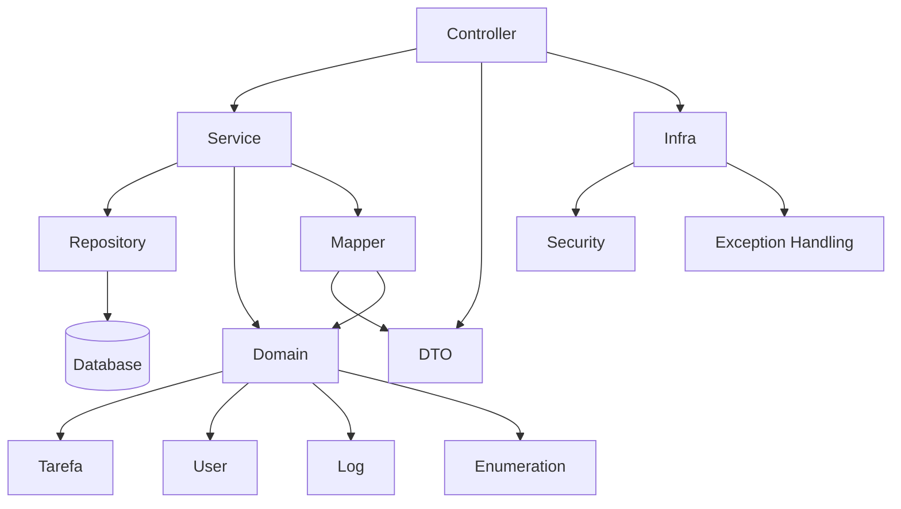

# Tasks API

API REST  para gerenciamento de tarefas, construída com **Java 21**, **Spring Boot 3**, arquitetura em camadas e integração com banco de dados **PostgreSQL**.

---

##  Tecnologias Utilizadas

* **Java 21**
* **Spring Boot 3.3**
* **Spring Web**
* **Spring Data JPA**
* **PostgreSQL**
* **Maven**
* **JUnit 5**
* **Lombok**
* **MapStruct**

---

## Funcionalidades

* Cadastrar tarefa
* Listar tarefas
* Buscar tarefa por ID
* Atualizar tarefa
* Exclusão lógica
* Paginação e ordenação
* Validações avançadas
* Camadas separadas para Controller, Service, Repository e DTOs

---

##  Estrutura principal do Projeto

```
src
├── main
│   ├── java
│   │   └── com.tarefas
│   │       ├── controller
│   │       ├── domain             
│   │       │   ├── enumeration
│   │       │   ├── log            
│   │       │   ├── tarefa         
│   │       │   └── user           
│   │       ├── dto                
│   │       ├── infra              
│   │       │   ├── exception      
│   │       │   └── security       
│   │       ├── mapper             
│   │       ├── repository         
│   │       ├── services           
│   │       ├── util               
│   │       └── TarefasApplication 
│   └── resources
│
├── test
│   ├── java
│   │   └── com.tarefas
│   │       ├── builder            
│   │       ├── controller         
│   │       ├── repository         
│   │       ├── services           
│   │       ├── utils              
│   │       └── TarefasApplicationTests
│   └── resources
│
├── target
├── pom.xml
└── README.md

```

---

## Diagrama de Arquitetura



---

##  Banco de Dados

A API utiliza **PostgreSQL**, com criação automática de tabelas via JPA.

Exemplo de configuração:

```properties
spring.datasource.url=jdbc:postgresql://localhost:3306/tasks
spring.datasource.username=${DB_USER}
spring.datasource.password=${DB_PASSWORD}
spring.jpa.hibernate.ddl-auto=update
```
As credenciais para conexão com banco foi realizada através de variáveis de ambiente.


---

##  Testes

Testes unitários implementados com:

* JUnit 5
* Mockito
* Spring Boot Test


## Como Executar

Clone o repositório:

```
git clone https://github.com/seuusuario/tasks-api.git
```

Execute com Maven:

```
mvn spring-boot:run
```

---

##  A documentação da API com o Swagger está disponível através do Endpoint:

```
/swagger-ui/index.html
```
## Até o momento, os testes através do Swagger estão diponíveis somente na branch develop.
## Para o primeiro acesso, é possível cadastrar um novo usuário através do Endpoint abaixo:

### Cadastrar usuário

```
POST /api/auth/register
```

```
POST /api/auth/login
```
---

## 🏗 Futuras Implementações

* Anexos nas tarefa
* Logs avançados
* Testes de integração 100%

---

##  Autores

Projeto desenvolvido por **Alessando Sousa** e **John Helder** com foco em arquitetura robusta e boas práticas profissionais.
 